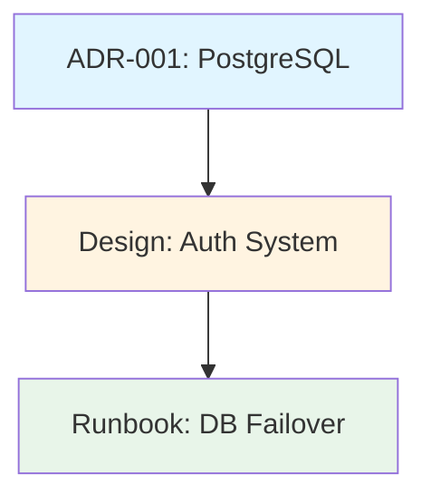

# Linking Conventions

This document defines conventions for linking documents in the fractary-docs plugin.

## Overview

The doc-linker skill provides four key capabilities:

1. **Document Indexes** - Generate browsable indexes of documentation
2. **Cross-References** - Link related documents bidirectionally
3. **Link Validation** - Find and fix broken links across documentation
4. **Relationship Graphs** - Visualize document relationships

## Link Types

### 1. Front Matter Links (related[])

Structured relationships declared in YAML front matter:

```yaml
---
title: "Design: User Authentication"
type: design
related:
  - "../adrs/ADR-003-jwt-tokens.md"
  - "./implementation-runbook.md"
  - "/docs/api/auth-api-spec.md"
---
```

**Characteristics**:
- Explicit, machine-readable relationships
- Can be bidirectional (both documents link to each other)
- Used for graph generation
- Validated by doc-linker

**Use Cases**:
- Link ADR to implementing design docs
- Link design to operational runbooks
- Link postmortem to resulting ADRs
- Link API spec to architecture docs

### 2. Inline Content Links

Standard markdown links in document body:

```markdown
See the [Authentication ADR](../adrs/ADR-003.md) for context.

For deployment procedures, refer to [this runbook](./deployment.md).
```

**Characteristics**:
- Natural reading flow
- Context-specific references
- Validated by link checker
- Not used for graph generation

**Use Cases**:
- Reference specific sections: `[Section](#heading)`
- Link to external resources: `[Docs](https://example.com)`
- Inline citations and references

### 3. Reference-Style Links

Markdown reference links for repeated URLs:

```markdown
See the [API documentation][api-docs] for details.

[api-docs]: https://api.example.com/docs
```

**Characteristics**:
- Cleaner document body
- Reusable URLs
- Validated by link checker

## Relationship Patterns

### ADR → Design

**Pattern**: Architecture decisions lead to system designs

**Example**:
```yaml
# ADR-003-jwt-tokens.md
---
title: "ADR-003: Use JWT for Authentication"
type: adr
status: accepted
related:
  - "../../designs/auth-system.md"
---
```

```yaml
# designs/auth-system.md
---
title: "Design: User Authentication System"
type: design
related:
  - "../adrs/ADR-003-jwt-tokens.md"
---
```

**Why**: ADRs define constraints, designs implement them. This creates a clear decision-to-implementation path.

### Design → Runbook

**Pattern**: System designs lead to operational procedures

**Example**:
```yaml
# designs/database-architecture.md
---
title: "Design: Database Architecture"
type: design
related:
  - "../runbooks/db-failover.md"
  - "../runbooks/db-backup.md"
---
```

```yaml
# runbooks/db-failover.md
---
title: "Runbook: Database Failover"
type: runbook
related:
  - "../designs/database-architecture.md"
---
```

**Why**: Designs explain systems, runbooks operate them. This connects architecture to operations.

### Postmortem → ADR

**Pattern**: Incidents lead to architectural changes

**Example**:
```yaml
# postmortems/2025-01-auth-outage.md
---
title: "Postmortem: Auth Service Outage"
type: postmortem
related:
  - "../adrs/ADR-005-circuit-breaker.md"
---
```

```yaml
# adrs/ADR-005-circuit-breaker.md
---
title: "ADR-005: Implement Circuit Breaker"
type: adr
status: accepted
related:
  - "../postmortems/2025-01-auth-outage.md"
---
```

**Why**: Postmortems identify problems, ADRs document solutions. This closes the learning loop.

### API Spec → Design + Implementation

**Pattern**: API documentation connects to architecture and code

**Example**:
```yaml
# api/user-api-spec.md
---
title: "User API Specification"
type: api-spec
version: "2.0"
related:
  - "../designs/auth-system.md"
  - "../designs/user-management.md"
---
```

**Why**: APIs are contracts. Linking to design and implementation maintains consistency.

### Test Report → Features

**Pattern**: Test results validate implementations

**Example**:
```yaml
# test-reports/auth-integration-tests.md
---
title: "Auth Integration Test Report"
type: test-report
environment: "staging"
related:
  - "../designs/auth-system.md"
  - "../api/auth-api-spec.md"
---
```

**Why**: Tests prove designs work. Linking results to features tracks quality.

## Path Conventions

### Relative Paths (Recommended)

Always use relative paths for internal links:

```yaml
related:
  - "../adrs/ADR-001.md"           # Parent directory
  - "./deployment-guide.md"         # Same directory
  - "../../docs/api/spec.md"        # Multiple levels up
```

**Benefits**:
- Repository can be moved without breaking links
- Works in any environment
- Clear directory structure

### Absolute Paths (Avoid)

Avoid absolute paths unless necessary:

```yaml
related:
  - "/docs/architecture/adrs/ADR-001.md"  # Avoid
```

**Only use when**:
- Linking to truly absolute locations
- Repository root-relative is critical

### External URLs

Use full URLs for external resources:

```yaml
related:
  - "https://example.com/docs"
```

## Bidirectional Linking

### What is Bidirectional Linking?

When A links to B, B automatically links back to A:

```yaml
# A.md
related: ["B.md"]

# B.md (automatically updated)
related: ["A.md"]
```

### Why Bidirectional?

1. **Discoverability**: Find related docs from either direction
2. **Context**: Understand full relationship
3. **Navigation**: Easy back-and-forth browsing
4. **Graph Integrity**: Complete relationship maps

### Configuration

Enable in `config/config.json`:

```json
{
  "linking": {
    "bidirectional_links": true
  }
}
```

### Usage

```bash
# Adds link in both documents
/fractary-docs:link design.md adr-003.md
```

## Document Indexes

### Purpose

Indexes provide:
- Central navigation hub
- Document discovery
- Status overview
- Type-based organization

### Creating Indexes

```bash
# By document type (default)
/fractary-docs:create-index docs/ --output INDEX.md

# By tags
/fractary-docs:create-index docs/ --output INDEX.md --group-by tag

# By date
/fractary-docs:create-index docs/ --output INDEX.md --group-by date

# Flat alphabetical
/fractary-docs:create-index docs/ --output INDEX.md --group-by flat
```

### Index Structure

**By Type**:
```markdown
## Architecture Decision Records
- [ADR-001: PostgreSQL](adrs/ADR-001.md) - *accepted*
- [ADR-002: Microservices](adrs/ADR-002.md) - *proposed*

## Design Documents
- [Auth System](designs/auth.md) - *approved*
```

**By Tag**:
```markdown
## authentication
- [ADR-003: JWT](adrs/ADR-003.md)
- [Auth Design](designs/auth.md)

## database
- [ADR-001: PostgreSQL](adrs/ADR-001.md)
```

### Index Maintenance

Regenerate indexes when:
- New documents added
- Documents moved
- Significant status changes
- Quarterly reviews

## Link Validation

### Checking Links

```bash
# Check single document
/fractary-docs:validate doc.md

# Check directory (internal links only)
/fractary-docs:link-check docs/

# Check external links (slower)
/fractary-docs:link-check docs/ --check-external
```

### Validation Reports

```json
{
  "total_files": 42,
  "files_with_broken_links": 3,
  "broken_links": [
    {
      "file": "docs/design.md",
      "line": 42,
      "link": "../missing.md",
      "type": "internal"
    }
  ]
}
```

### Fixing Broken Links

**Manual Fix**:
1. Review broken link report
2. Find correct target path
3. Update link in document

**Auto-Fix** (experimental):
```bash
/fractary-docs:link-check docs/ --fix-mode
```

Attempts to locate moved files and update links automatically.

## Relationship Graphs

### Purpose

Graphs visualize:
- Document relationships
- Information architecture
- Knowledge clusters
- Orphaned documents

### Generating Graphs

```bash
# Mermaid diagram (default)
/fractary-docs:generate-graph docs/ --output GRAPH.md

# GraphViz DOT
/fractary-docs:generate-graph docs/ --output graph.dot --format dot

# JSON for custom processing
/fractary-docs:generate-graph docs/ --output graph.json --format json

# Include tag relationships
/fractary-docs:generate-graph docs/ --output GRAPH.md --include-tags
```

### Mermaid Example



### Graph Analysis

Use graphs to:
- Identify documentation gaps
- Find orphaned documents
- Validate architecture consistency
- Plan documentation improvements

## Best Practices

### 1. Link Semantically Related Documents

**Good**:
```yaml
# ADR about database choice
related:
  - "../designs/database-schema.md"  # Implementing design
  - "../runbooks/db-maintenance.md"   # Operations
```

**Bad**:
```yaml
# ADR about database choice
related:
  - "../designs/frontend-ui.md"  # Unrelated
```

### 2. Limit Related Documents

Keep `related[]` arrays focused (max 5-10 links):

**Good**:
```yaml
related:
  - "../adrs/ADR-003.md"
  - "./implementation-guide.md"
  - "../runbooks/deployment.md"
```

**Bad**:
```yaml
related:
  - "../adrs/ADR-001.md"
  - "../adrs/ADR-002.md"
  - "../adrs/ADR-003.md"
  # ... 20 more links
```

### 3. Update Links When Moving Files

When moving files, update related links:

```bash
# Move file
git mv docs/old-location.md docs/new-location.md

# Update references
/fractary-docs:link-check docs/ --fix-mode

# Or manually update front matter
```

### 4. Use Inline Links for Context

Use inline content links for specific references:

```markdown
The authentication flow (see [Auth Design](./auth.md#flow)) uses JWT tokens
as decided in [ADR-003](../adrs/ADR-003.md).
```

Use front matter for structural relationships:

```yaml
related:
  - "./auth.md"
  - "../adrs/ADR-003.md"
```

### 5. Check Links Before Committing

Always validate before committing:

```bash
# Check links
/fractary-docs:link-check docs/

# If clean, commit
git add docs/
git commit -m "Update documentation"
```

### 6. Regenerate Indexes Regularly

Update indexes after significant changes:

```bash
# After adding new docs
/fractary-docs:create-index docs/ --output INDEX.md

git add INDEX.md
git commit -m "Update documentation index"
```

### 7. Review Graphs Quarterly

Generate relationship graphs quarterly to:
- Identify gaps
- Find orphans
- Validate structure

```bash
/fractary-docs:generate-graph docs/ --output GRAPH.md
# Review graph visually
```

### 8. Use Consistent Paths

Be consistent with path styles:

**Good**:
```yaml
related:
  - "../adrs/ADR-001.md"
  - "../adrs/ADR-002.md"
  - "../designs/auth.md"
```

**Bad** (mixing styles):
```yaml
related:
  - "../adrs/ADR-001.md"      # Relative
  - "/docs/adrs/ADR-002.md"   # Absolute
  - "designs/auth.md"         # Inconsistent
```

### 9. Document Relationship Rationale

Add comments explaining non-obvious links:

```yaml
related:
  # Implements decision to use JWT
  - "../adrs/ADR-003-jwt.md"

  # Operational procedures for auth system
  - "../runbooks/auth-troubleshooting.md"
```

### 10. Avoid Circular References

Don't create circular dependency loops:

**Avoid**:
```
A → B → C → A  (circular)
```

**Prefer**:
```
Root → A → B → C  (hierarchical)
```

## Configuration

Configure linking behavior in `config/config.json`:

```json
{
  "linking": {
    "auto_link_related": true,
    "bidirectional_links": true,
    "max_related_docs": 10,
    "link_patterns": {
      "adr_to_design": true,
      "design_to_runbook": true,
      "postmortem_to_adr": true
    }
  }
}
```

### Options

| Option | Type | Default | Description |
|--------|------|---------|-------------|
| auto_link_related | boolean | true | Automatically suggest related documents |
| bidirectional_links | boolean | true | Create two-way links |
| max_related_docs | number | 10 | Maximum items in related[] |
| link_patterns | object | {...} | Enable relationship patterns |

### Link Patterns

Enable specific relationship patterns:

```json
{
  "link_patterns": {
    "adr_to_design": true,      // ADR → Design
    "design_to_runbook": true,  // Design → Runbook
    "postmortem_to_adr": true,  // Postmortem → ADR
    "api_to_design": true,      // API Spec → Design
    "test_to_feature": true     // Test Report → Feature
  }
}
```

## Commands

### Create Index

```bash
/fractary-docs:create-index <directory> [options]

Options:
  --output <file>       Output file path
  --title <title>       Index title
  --group-by <strategy> Grouping: type|tag|date|flat
```

### Update References

```bash
/fractary-docs:link <source> <target> [options]

Options:
  --one-way            Disable bidirectional linking
  --no-validate        Skip file existence check
```

### Find Broken Links

```bash
/fractary-docs:link-check <directory> [options]

Options:
  --check-external     Check HTTP/HTTPS URLs
  --fix-mode           Attempt auto-fix
  --recursive          Scan subdirectories (default: true)
```

### Generate Graph

```bash
/fractary-docs:generate-graph <directory> [options]

Options:
  --output <file>      Output file path
  --format <fmt>       Format: mermaid|dot|json
  --include-tags       Add tag relationships
```

## Troubleshooting

### Issue: "Circular reference detected"

**Cause**: A → B → A loop

**Fix**: Remove one direction or introduce hierarchy

### Issue: "Max related docs exceeded"

**Cause**: Too many links in related[]

**Fix**: Keep only most relevant links, increase max_related_docs in config

### Issue: "Link not found"

**Cause**: File moved or deleted

**Fix**: Update or remove broken link

### Issue: "Bidirectional link failed"

**Cause**: Target file has no front matter

**Fix**: Add front matter to target file

## Examples

### Example 1: Linking ADR to Design

```bash
# Create bidirectional link
/fractary-docs:link \
  docs/adrs/ADR-003-jwt.md \
  docs/designs/auth-system.md
```

Result:
```yaml
# ADR-003-jwt.md
related: ["../../designs/auth-system.md"]

# auth-system.md
related: ["../adrs/ADR-003-jwt.md"]
```

### Example 2: Creating Type-Based Index

```bash
/fractary-docs:create-index \
  docs/ \
  --output docs/INDEX.md \
  --title "Architecture Documentation" \
  --group-by type
```

### Example 3: Finding Broken Links

```bash
# Check all docs
/fractary-docs:link-check docs/

# Output shows broken links with file:line
```

### Example 4: Generating Mermaid Graph

```bash
/fractary-docs:generate-graph \
  docs/ \
  --output docs/GRAPH.md \
  --format mermaid

# View GRAPH.md in Markdown viewer
```

## Reference

- **Linking Scripts**: `skills/doc-linker/scripts/`
- **Front Matter Schema**: `skills/doc-generator/docs/frontmatter-schema.md`
- **Validation Rules**: `skills/doc-validator/docs/validation-rules.md`
- **Mermaid Documentation**: https://mermaid.js.org/
- **GraphViz Documentation**: https://graphviz.org/
