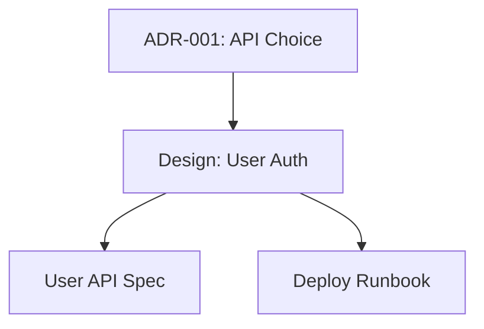

# SPEC-00029-07: Doc Validation and Linking

**Issue**: #29
**Phase**: 2 (fractary-docs Plugin)
**Dependencies**: SPEC-00029-04, SPEC-00029-05, SPEC-00029-06
**Status**: Draft
**Created**: 2025-01-15

## Overview

Implement doc-validator and doc-linker skills to ensure documentation quality and manage cross-references across all project documentation.

## doc-validator Skill

### Validation Checks

1. **Markdown Linting**: Use markdownlint or similar
2. **Front Matter**: Validate YAML syntax and required fields
3. **Structure**: Ensure required sections present per doc type
4. **Links**: Check internal and external link validity
5. **Spelling**: Optional spell check
6. **Template Compliance**: Verify doc matches template requirements

### Implementation

**scripts/lint-markdown.sh**: Run markdownlint
**scripts/check-frontmatter.sh**: Validate YAML
**scripts/validate-structure.sh**: Check sections
**scripts/check-links.sh**: Verify links

### Validation Rules by Type

**ADR**:
- Required sections: Status, Context, Decision, Consequences
- Status must be: proposed|accepted|deprecated|superseded
- Must have date field

**Design**:
- Required sections: Overview, Architecture, Implementation
- Must have diagrams or diagram placeholder

**Runbook**:
- Required sections: Purpose, Steps, Troubleshooting
- Steps must be numbered or checkboxes

## doc-linker Skill

### Linking Operations

1. **Create Index**: Generate documentation catalog
2. **Update References**: Auto-update cross-references
3. **Find Broken Links**: Identify dead links
4. **Generate Graph**: Visualize documentation relationships

### Implementation

**scripts/create-index.sh**: Generate `/docs/README.md`
**scripts/update-references.sh**: Update links when docs move
**scripts/find-broken-links.sh**: Scan all docs for dead links
**scripts/generate-graph.sh**: Create mermaid diagram of doc relationships

### Documentation Index Format

```markdown
# Documentation Index

Last Updated: {{date}}

## Architecture
- [ADR-001: API Choice](/docs/architecture/adrs/ADR-001-api-choice.md)
- [Design: User Auth](/docs/architecture/designs/user-auth.md)

## Operations
- [Runbook: Deployment](/docs/operations/runbooks/deployment.md)

## API
- [User API](/docs/api/user-api.md)

## Testing
- [Test Report 2025-01-15](/docs/testing/test-report-2025-01-15.md)
```

### Link Graph

Generate mermaid diagram showing doc dependencies:



## Success Criteria

- [ ] Validation catches common errors
- [ ] Required sections enforced per doc type
- [ ] Link checking finds broken links
- [ ] Index auto-generated and updated
- [ ] Doc graph visualization
- [ ] Integration with doc-generator and doc-updater

## Timeline

**Estimated**: 1 week

## Next Steps

- **SPEC-00029-08**: Begin Phase 3 (fractary-spec plugin)
